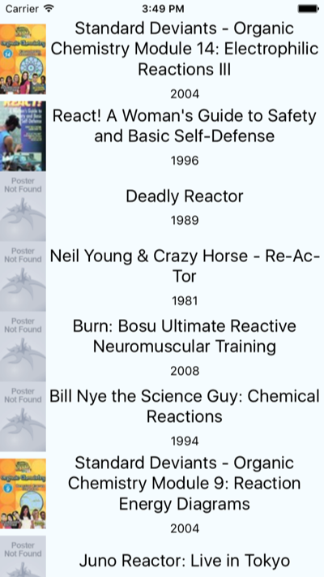
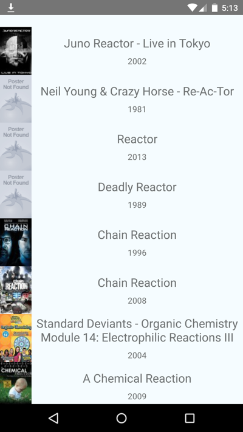

## ReactNativeCouchbaseLiteExample

Example project to get started with the React Native Couchbase Lite module.

### Getting Started

The instructions below apply to both the iOS and Android versions of the example app.

1. Open `ios/ReactNativeCouchbaseLiteExample.xcodeproj` for iOS and `android/build.gradle` for Android.
2. Run `npm install` and `react-native start`.
3. Run the app on a simulator or device.
4. Start Sync Gateway:

  ```
  $ ~/Downloads/couchbase-sync-gateway/bin/sync-gateway sync-gateway-config.json
  ```

5. From the current directory, run the following command to import documents.

  ```
  $ curl -H 'Content-Type: application/json' -vX POST 'http://localhost:4984/moviesapp/_bulk_docs' -d @MoviesExample.json
```

6. You should now see the list of movies in the iOS app:

	

	

	**Note**: On Android, you must open a port mapping with `adb reverse tcp:4984 tcp:4984` to make the Sync Gateway accessible from the Couchbase Listener.